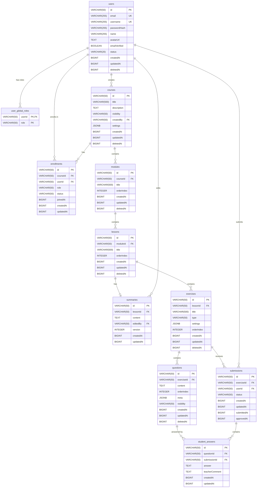

# lib4gz Database Schema

## Overview

- **Database**: PostgreSQL
- **ID Strategy**: Application-generated TypeIDs stored as `VARCHAR(50)` — type-prefixed, UUIDv7-based, Crockford Base32 encoded (e.g., `usr_01h455vb4pex5vsknk084sn02q`)
- **Timestamps**: All stored as `BIGINT` epoch milliseconds (camelCase naming: `createdAt`, `updatedAt`)
- **Soft Delete**: `deletedAt BIGINT` column (NULL means active, non-NULL means deleted)
- **JSONB**: Used for flexible metadata (course settings, question meta, exercise settings)

---

## DDL

### users

```sql
CREATE TABLE users (
    id              VARCHAR(50)     PRIMARY KEY,
    email           VARCHAR(255)    UNIQUE,
    username        VARCHAR(255)    UNIQUE NOT NULL,
    passwordHash    VARCHAR(255),
    name            VARCHAR(255)    NOT NULL,
    avatarUrl       TEXT,
    emailVerified   BOOLEAN         NOT NULL DEFAULT FALSE,
    status          VARCHAR(20)     NOT NULL DEFAULT 'ACTIVE',
    createdAt       BIGINT          NOT NULL,
    updatedAt       BIGINT          NOT NULL,
    deletedAt       BIGINT,

    CONSTRAINT chk_users_status CHECK (status IN ('ACTIVE', 'INACTIVE', 'BANNED'))
);
```

### user_global_roles

```sql
CREATE TABLE user_global_roles (
    userId      VARCHAR(50)     NOT NULL,
    role        VARCHAR(50)     NOT NULL,

    PRIMARY KEY (userId, role),

    CONSTRAINT fk_user_global_roles_user
        FOREIGN KEY (userId) REFERENCES users(id) ON DELETE CASCADE,

    CONSTRAINT chk_user_global_roles_role CHECK (role IN ('ADMIN', 'USER', 'TEACHER'))
);
```

### courses

```sql
CREATE TABLE courses (
    id              VARCHAR(50)     PRIMARY KEY,
    title           VARCHAR(500)    NOT NULL,
    description     TEXT,
    visibility      VARCHAR(50)     NOT NULL DEFAULT 'PRIVATE',
    createdBy       VARCHAR(50)     NOT NULL,
    settings        JSONB           DEFAULT '{}',
    createdAt       BIGINT          NOT NULL,
    updatedAt       BIGINT          NOT NULL,
    deletedAt       BIGINT,

    CONSTRAINT fk_courses_created_by
        FOREIGN KEY (createdBy) REFERENCES users(id),

    CONSTRAINT chk_courses_visibility CHECK (visibility IN ('PUBLIC', 'PRIVATE'))
);

CREATE INDEX idx_courses_created_by ON courses(createdBy);
```

### enrollments

```sql
CREATE TABLE enrollments (
    id              VARCHAR(50)     PRIMARY KEY,
    courseId         VARCHAR(50)     NOT NULL,
    userId          VARCHAR(50)     NOT NULL,
    role            VARCHAR(50)     NOT NULL,
    status          VARCHAR(50)     NOT NULL DEFAULT 'PENDING',
    joinedAt        BIGINT,
    createdAt       BIGINT          NOT NULL,
    updatedAt       BIGINT          NOT NULL,

    CONSTRAINT fk_enrollments_course
        FOREIGN KEY (courseId) REFERENCES courses(id) ON DELETE CASCADE,

    CONSTRAINT fk_enrollments_user
        FOREIGN KEY (userId) REFERENCES users(id) ON DELETE CASCADE,

    CONSTRAINT uq_enrollments_course_user UNIQUE (courseId, userId),

    CONSTRAINT chk_enrollments_role CHECK (role IN ('TEACHER', 'LEARNER')),
    CONSTRAINT chk_enrollments_status CHECK (status IN ('PENDING', 'ACTIVE', 'INACTIVE'))
);

CREATE INDEX idx_enrollments_course_id ON enrollments(courseId);
CREATE INDEX idx_enrollments_user_id ON enrollments(userId);
```

### modules

```sql
CREATE TABLE modules (
    id              VARCHAR(50)     PRIMARY KEY,
    courseId         VARCHAR(50)     NOT NULL,
    title           VARCHAR(500)    NOT NULL,
    orderIndex      INTEGER         NOT NULL,
    createdAt       BIGINT          NOT NULL,
    updatedAt       BIGINT          NOT NULL,
    deletedAt       BIGINT,

    CONSTRAINT fk_modules_course
        FOREIGN KEY (courseId) REFERENCES courses(id) ON DELETE CASCADE,

    CONSTRAINT uq_modules_course_order UNIQUE (courseId, orderIndex)
);

CREATE INDEX idx_modules_course_id ON modules(courseId);
```

### lessons

```sql
CREATE TABLE lessons (
    id              VARCHAR(50)     PRIMARY KEY,
    moduleId        VARCHAR(50)     NOT NULL,
    title           VARCHAR(500)    NOT NULL,
    orderIndex      INTEGER         NOT NULL,
    createdAt       BIGINT          NOT NULL,
    updatedAt       BIGINT          NOT NULL,
    deletedAt       BIGINT,

    CONSTRAINT fk_lessons_module
        FOREIGN KEY (moduleId) REFERENCES modules(id) ON DELETE CASCADE,

    CONSTRAINT uq_lessons_module_order UNIQUE (moduleId, orderIndex)
);

CREATE INDEX idx_lessons_module_id ON lessons(moduleId);
```

### summaries

```sql
CREATE TABLE summaries (
    id              VARCHAR(50)     PRIMARY KEY,
    lessonId        VARCHAR(50)     UNIQUE NOT NULL,
    content         TEXT            NOT NULL,
    editedBy        VARCHAR(50)     NOT NULL,
    version         INTEGER         NOT NULL DEFAULT 1,
    createdAt       BIGINT          NOT NULL,
    updatedAt       BIGINT          NOT NULL,

    CONSTRAINT fk_summaries_lesson
        FOREIGN KEY (lessonId) REFERENCES lessons(id) ON DELETE CASCADE,

    CONSTRAINT fk_summaries_edited_by
        FOREIGN KEY (editedBy) REFERENCES users(id)
);

CREATE INDEX idx_summaries_lesson_id ON summaries(lessonId);
```

### exercises

```sql
CREATE TABLE exercises (
    id              VARCHAR(50)     PRIMARY KEY,
    lessonId        VARCHAR(50)     NOT NULL,
    title           VARCHAR(500)    NOT NULL,
    type            VARCHAR(50)     NOT NULL,
    settings        JSONB           DEFAULT '{}',
    orderIndex      INTEGER         NOT NULL,
    createdAt       BIGINT          NOT NULL,
    updatedAt       BIGINT          NOT NULL,
    deletedAt       BIGINT,

    CONSTRAINT fk_exercises_lesson
        FOREIGN KEY (lessonId) REFERENCES lessons(id) ON DELETE CASCADE,

    CONSTRAINT uq_exercises_lesson_order UNIQUE (lessonId, orderIndex),

    CONSTRAINT chk_exercises_type CHECK (type IN ('QUIZ', 'ASSIGNMENT', 'PRACTICE'))
);

CREATE INDEX idx_exercises_lesson_id ON exercises(lessonId);
```

### questions

Note: `exerciseId` is a plain UUID column in the JPA entity (no `@ManyToOne` relationship). It is still a logical foreign key to `exercises`.

```sql
CREATE TABLE questions (
    id              VARCHAR(50)     PRIMARY KEY,
    exerciseId      VARCHAR(50)     NOT NULL,
    content         TEXT            NOT NULL,
    orderIndex      INTEGER         NOT NULL,
    meta            JSONB           DEFAULT '{}',
    visibility      VARCHAR(50)     DEFAULT 'VISIBLE',
    createdAt       BIGINT          NOT NULL,
    updatedAt       BIGINT          NOT NULL,
    deletedAt       BIGINT,

    CONSTRAINT fk_questions_exercise
        FOREIGN KEY (exerciseId) REFERENCES exercises(id) ON DELETE CASCADE,

    CONSTRAINT chk_questions_visibility CHECK (visibility IN ('VISIBLE', 'HIDDEN'))
);

CREATE INDEX idx_questions_exercise_id ON questions(exerciseId);
```

### submissions

```sql
CREATE TABLE submissions (
    id              VARCHAR(50)     PRIMARY KEY,
    exerciseId      VARCHAR(50)     NOT NULL,
    userId          VARCHAR(50)     NOT NULL,
    status          VARCHAR(50)     NOT NULL DEFAULT 'DRAFT',
    createdAt       BIGINT          NOT NULL,
    updatedAt       BIGINT          NOT NULL,
    submittedAt     BIGINT,
    approvedAt      BIGINT,

    CONSTRAINT fk_submissions_exercise
        FOREIGN KEY (exerciseId) REFERENCES exercises(id) ON DELETE CASCADE,

    CONSTRAINT fk_submissions_user
        FOREIGN KEY (userId) REFERENCES users(id) ON DELETE CASCADE,

    CONSTRAINT uq_submissions_exercise_user UNIQUE (exerciseId, userId),

    CONSTRAINT chk_submissions_status CHECK (status IN ('DRAFT', 'SUBMITTED', 'REVISION_REQUESTED', 'APPROVED'))
);

CREATE INDEX idx_submissions_exercise_id ON submissions(exerciseId);
CREATE INDEX idx_submissions_user_id ON submissions(userId);
```

### student_answers

```sql
CREATE TABLE student_answers (
    id              VARCHAR(50)     PRIMARY KEY,
    questionId      VARCHAR(50)     NOT NULL,
    submissionId    VARCHAR(50)     NOT NULL,
    answer          TEXT,
    teacherComment  TEXT,
    createdAt       BIGINT          NOT NULL,
    updatedAt       BIGINT          NOT NULL,

    CONSTRAINT fk_student_answers_question
        FOREIGN KEY (questionId) REFERENCES questions(id) ON DELETE CASCADE,

    CONSTRAINT fk_student_answers_submission
        FOREIGN KEY (submissionId) REFERENCES submissions(id) ON DELETE CASCADE
);

CREATE INDEX idx_student_answers_question_id ON student_answers(questionId);
CREATE INDEX idx_student_answers_submission_id ON student_answers(submissionId);
```

---

## Entity-Relationship Diagram



---

## Soft Delete Summary

| Table         | Soft Delete | Notes                                          |
|---------------|-------------|-------------------------------------------------|
| users         | Yes         | `deletedAt` column                              |
| courses       | Yes         | `deletedAt` column                              |
| enrollments   | No          | Status-based lifecycle (PENDING/ACTIVE/INACTIVE)|
| modules       | Yes         | `deletedAt` column                              |
| lessons       | Yes         | `deletedAt` column                              |
| summaries     | No          | Versioned, not deleted                          |
| exercises     | Yes         | `deletedAt` column                              |
| questions     | Yes         | `deletedAt` column                              |
| submissions   | No          | Status-based lifecycle (DRAFT/SUBMITTED/etc.)   |
| student_answers | No        | Tied to submission lifecycle                    |

---

## Enum Values Reference

| Column                    | Allowed Values                                    |
|---------------------------|---------------------------------------------------|
| `users.status`            | `ACTIVE`, `INACTIVE`, `BANNED`                    |
| `user_global_roles.role`  | `ADMIN`, `USER`, `TEACHER`                          |
| `courses.visibility`      | `PUBLIC`, `PRIVATE`                               |
| `enrollments.role`        | `TEACHER`, `LEARNER`                              |
| `enrollments.status`      | `PENDING`, `ACTIVE`, `INACTIVE`                   |
| `exercises.type`          | `QUIZ`, `ASSIGNMENT`, `PRACTICE`                  |
| `questions.visibility`    | `VISIBLE`, `HIDDEN`                               |
| `submissions.status`      | `DRAFT`, `SUBMITTED`, `REVISION_REQUESTED`, `APPROVED` |
